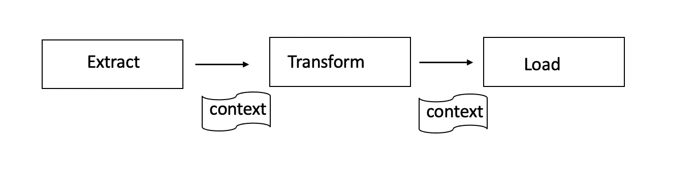

# ETL using SQL (Dask-sql)

#### A POC to perform ETL using DASK and SQL

There are number of fantastic tools available to perform ETL which are capable of using dask as executor (both as a scheduler & compute engine)

1. Airflow
2. prefect
3. Dagster 

The idea of this repo is wherever the dask was doing the heavy lifting in the ETL, Dask-SQL can make use of this already existing dask setting/infrastructure and provides kind of pure `SQL` user experience in ETL for end User.


As of now, tried implementing ETL in prefect .

It seems we can easily implement customTasks in prefect and use that in our ETL Dag.

### Approach taken :
================



1. created a Dask-Sql context newly in each task
2. Passed context from one task to another task .


```
To try this out use the makefile for setup, and add dask folder inside 
prefect task library
```

for example :

---
### create table --> transform table --> query table --> load table 
---

only when the first task passes the context to second task, second task knows about the newly created table (which is registered in the dask-sql context) 

As you have guessed this is not a right approach . 

#### TODO :

spinup a  Dask-sql server using dask-scheduler address, do your ETL and tear down the dask-sql server .


#### please let me know if you have any better idea !!!
