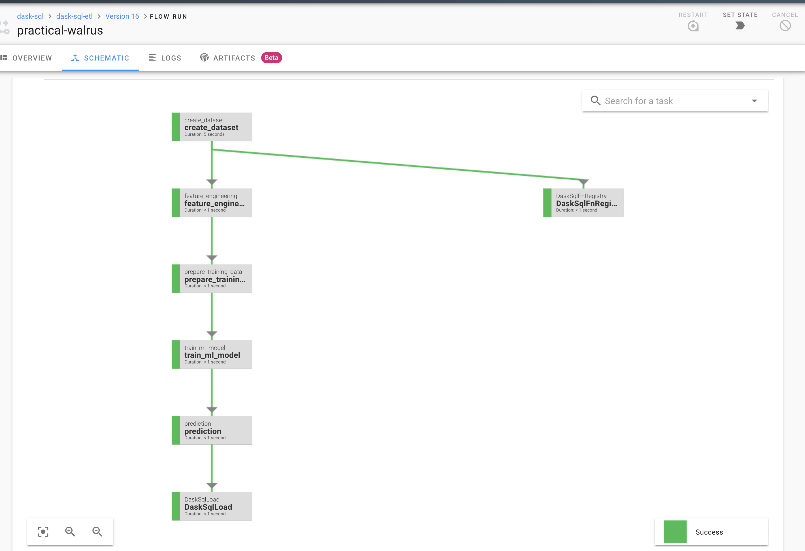

## setup instructions

```make -f Makefile ```

```
Usage:
  make <target>

Targets:
  venv                           create a virtual environment for development
  clean                          clean all files using .gitignore rules
  scrub                          clean all files, even untracked files
  start_server                   starts prefect server
  start_agent                    starts prefect agent
  stop_server                    stops prefect server
  start_dask_scheduler           starts dask-scheduler
  start_dask_worker              starts dask-scheduler
  run_etl                        Run's example Dask-sql ETL
  help                           Show help

```

### order of steps

1. start virtualenv
2. start prefect server & agent
3. start dask-distribuited server & worker
4. run Sql etl

#### prefect Dag 

- Run the dag from server UI or 
- just run with normal command `python sql_etl.py`

